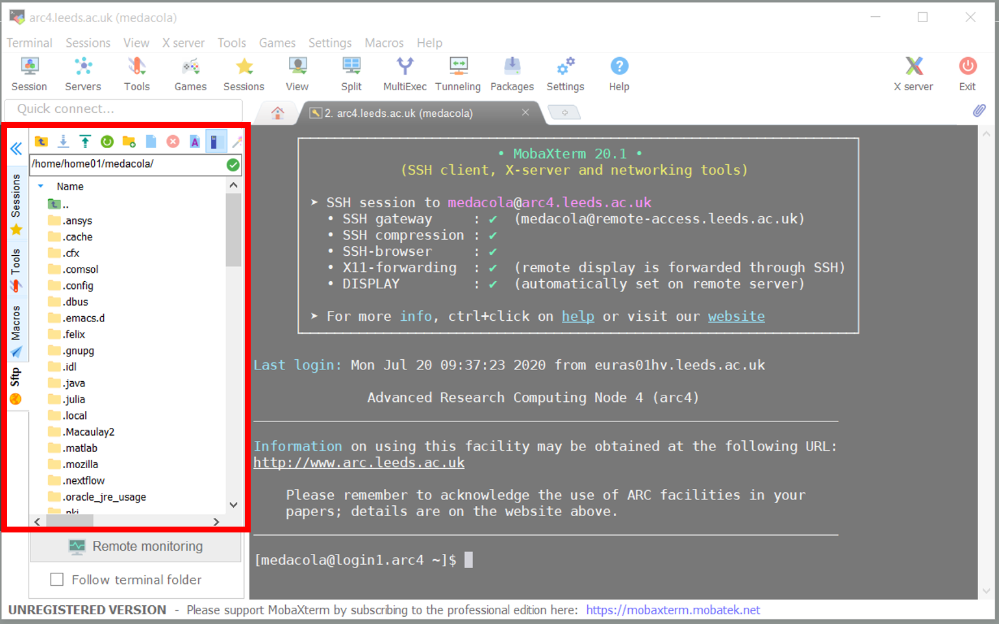
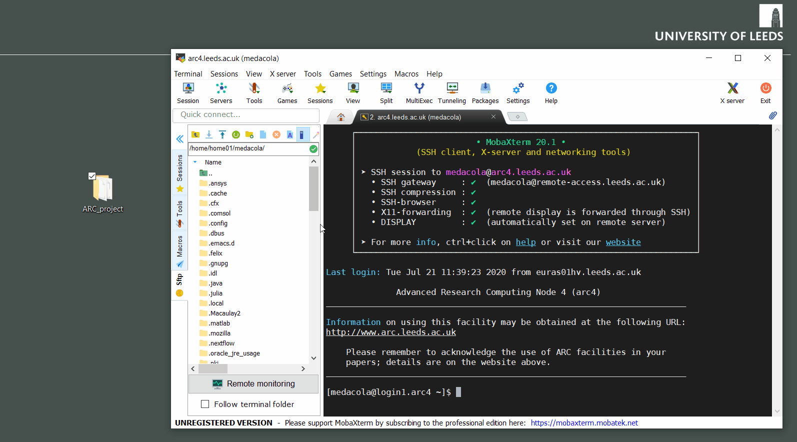
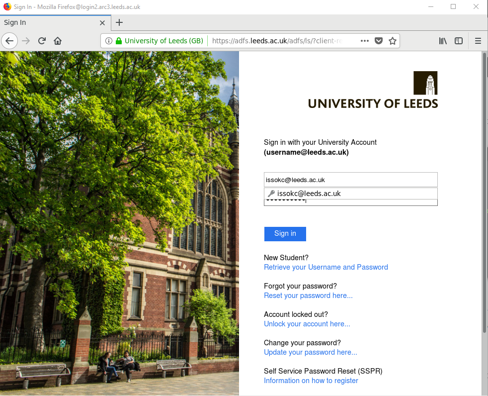

# File Transfer

Moving files onto and off the HPC systems is a crucial part of any researchers workflow and on this page we'll outline a number of approaches for performing file transfer.

## Using MobaXTerm

Windows users who make use of MobaXTerm can take advantage of some builtin tools for file management. By default when a user connects to ARC through MobaXTerm files are displayed in the left-hand file explorer window (highlighted in red).



 In this file explorer we can see all the folders and files within the directory path specified at the top (in this example `/home/home01/medacola/`), we can change this directory path if we wish to look in a different directory (that we have permission to view).

<p style="text-align:center;">

```{image} ../assets/img/filetransfer/mobaWindow2.png
:alt: Zoomed in view of MobaXTerm file explorer
:width: 250px
```

</p>

We can also download files from ARC onto our local computer by selecting them in the file explorer window and pressing the Download icon .

We can upload files and directories using this file explorer by dragging and dropping them into that window.



We can also download files and directories from HPC to our local machine using this drag and drop approach with MobaXTerm, shown below.


This allows us to performance basic file transfer steps using the MobaXTerm GUI. We can also make use of the MobaXTerm terminal to perform command based file transfer as outlined the in next section [Using a Terminal](#Using-a-Terminal).

## Using a Terminal

We can also download and upload files to HPC using commands in a Terminal. The following steps will outline the use of two commands `scp` and `rsync` that allow for file transfer from a local machine to a remote machine or vice versa.

```{note} **MobaXTerm users** <br>
If you're using MobaXTerm's local terminal make sure you've configured it properly using the steps outlined in [Logging on](logon.html#configuring-mobaxterm-terminal).
```

### Using scp

The `scp` command stands for the secure copy protocol. It uses `ssh` to connect to a remote computer and copy the file or directory to that remote host. As with all linux commands it also have a number of additonal options which you can learn more about by checking its manual page by running `man scp`.

The standard format of the `scp` command is `scp /path/to/file/to/copy /path/to/location/to/copy/to` where we specify the path to the file we want to copy and then the path to the location where we want it copied to. This looks much like a standard `cp` command but the power of `scp` comes from allowing us to specify either of these paths on another remote machine. We do this by adding at the start of the path `user@remote:` for instance to get files from my personal /nobackup i'd specify `medacola@arc4.leeds.ac.uk:/nobackup/medacola`, note the comma between the path and the remote address as this won't work without the comma. Using `scp` will prompt us for our password for both remote-access and ARC4 itself as we need to log in to the remote computer to perform the copy.

1. Uploading files and directories from local machine to remote machine

    ```bash
    # we have a file called helloworld.py we want to move to ARC4
    $ ls
    helloworld.py README.md
    # we can see the file is in my current directory
    $ scp helloworld.py medacola@arc4.leeds.ac.uk:/nobackup/medacola
    helloworld.py                                            100%    0     0.0KB/s   00:00
    ```

    Uploading directories works in the same way but requires the addition of the `scp -r` option, which specifies we copy items recursively.

    ```bash
    # say we want to transfer the directory containing helloworld.py
    $ cd ..
    $ ls 
    File_transfer_folder
    $ scp -r File_transfer_folder medacola@arc4.leeds.ac.uk:/nobackup/medacola
    File_transfer_folder                                            100%    0     0.0KB/s   00:00
    ```

2. Downloading files and directories from remote machine to local machine

    ```bash
    # we have a file called results.data on ARC4 we want to download to our local machine
    # from our local machine we do the following
    $ scp medacola@arc4.leeds.ac.uk:/nobackup/medacola/Project1/results.data /home/medacola/Downloads
    results.data                                          100%    0     0.0KB/s   00:00
    ```

    Downloading directories from HPC to your local machine operates in much the same way described above.

    ```bash
    # from our local machine we do the following
    $ scp -r medacola@arc4.leeds.ac.uk:/nobackup/medacola/Project1/ /home/medacola/Downloads
    results.data                                          100%    0     0.0KB/s   00:00
    ```

### Using rsync

The `rsync` command is another file transfer command that is considered more versatile than `scp` especially for large file transfers as it enables for interrupted transfers to continue from the point at which they were interrupted rather than starting from the beginning.

There are also a number of additional options that can be used with the `rsync` command, in particular these examples will make use of the options `-avn`, where `-v` is for verbose, `-a` is for archive mode, and `-n` is for dry run which allows `rsync` to do a trial run with no changes made (often useful for checking everything works).

1. Uploading files and directories from local machine to remote machine

    ```bash
    # we have a file called helloworld.py we want to move to ARC4
    $ ls
    helloworld.py README.md
    # we can see the file is in my current directory
    $ rsync -avn helloworld.py medacola@arc4.leeds.ac.uk:/nobackup/medacola
    helloworld.py

    sent 26 bytes  received 70 bytes  4.47 bytes/sec
    total size is 0  speedup is 0.00 (DRY RUN)

    # as we're happy with the above dry run we now run the command again with -n
    $ rsync -av helloworld.py medacola@arc4.leeds.ac.uk:/nobackup/medacola
    helloworld.py

    sent 26 bytes  received 70 bytes  4.47 bytes/sec
    total size is 0  speedup is 0.00
    ```

    Uploading directories works in the exact same way as above but requires you to ensure you include a trailing `/` after the directory you wish to upload.

    ```bash
    # say we want to transfer the directory containing helloworld.py
    $ cd ..
    $ ls 
    File_transfer_folder
    $ rsync -av File_transfer_folder/ medacola@arc4.leeds.ac.uk:/nobackup/medacola
    
    receiving incremental file list
    ./
    helloworld.py
    README.md

    sent 40 bytes  received 128 bytes  6.34 bytes/sec
    total size is 0  speedup is 0.00 
    ```

2. Downloading files and directories from remote machine to local machine

    ```bash
    # we have a file called results.data on ARC4 we want to download to our local machine
    # from our local machine we do the following
    $ rsync -av medacola@arc4.leeds.ac.uk:/nobackup/medacola/Project1/results.data /home/medacola/Downloads
    results.data

    sent 26 bytes  received 70 bytes  4.47 bytes/sec
    total size is 0  speedup is 0.00
    ```

    Downloading directories from HPC to your local machine operates in much the same way described above.

    ```bash
    # from our local machine we do the following
    $ rsync -av medacola@arc4.leeds.ac.uk:/nobackup/medacola/Project1/ /home/medacola/Downloads
    receiving incremental file list
    ./
    results.data

    sent 40 bytes  received 128 bytes  6.34 bytes/sec
    total size is 0  speedup is 0.00 
    ```

## Other file transfer options

### smbclient

It is also possible to transfer files from your University ` M drive ` and from the shared ` N drive ` using the ` smbclient ` tool. This is a command line tool included by default on ARC that allows for file transfer experience similar to SFTP [(outlined below)](#sftp).

To connect to your ` M drive ` you are required to know the ds path to your M drive. This should follow the pattern ` \\ds.leeds.ac.uk\<group>\<groupNUMBER>\ `. Connecting to the shared N drive is possible using the folowing ds path `\\ds.leeds.ac.uk\shared\`.

Once you know the ds path to your M drive you can connect to it within the ` smbclient ` when on ARC using the command:

```bash
$ smbclient -U medacola //ds.leeds.ac.uk/****/****/ --directory medacola # **** signify removed content
Enter DS\\medacola\'s password:
Try "help" to get a list of possible commands.
smb: \\>
```

You are prompted to log in using your standard University of Leeds password and once successful the prompt switches to the clients prompt ` smb: \> `. The option ` --directory ` is used here to specify that we want to log into a specific ` M drive ` (if you don't include this you'll be logged in a level up from your person M drive and need to `cd USERNAME` into your personal M drive). You can get a list of all possible commands for this prompt by typing ` help ` and using this client to download files will download them into the directory you were in on ARC when you used the ` smbclient ` command. You can leave the ` smbclient ` anytime by typing ` exit ` to return to ARC.

To download files from your M drive onto the current directory you're in on ARC you'd do the following:

```bash
smb: \\medacola\\> get test.sh
getting file \\medacola\\test.sh of size 19 as test.sh (18.6 KiloBytes/sec) (average 18.6 KiloBytes/sec)
smb: \\medacola\\>
```

To upload a file from ARC to your M drive (In this instance on ARC I have a file called ` testfile ` in my current directory I want to transfer to my M drive) we use the following command on ARC:

```bash
$ smbclient -U medacola //ds.leeds.ac.uk/****/****/ --directory medacola -c 'put "testfile"'
putting file testfile as \\medacola\\testfile (0.0 kb/s) (average 0.0 kb/s)
```

### rclone

When transferring large data sets from external sources, it is useful to be able to connect directly to the external sources (such as OneDrive, DropBox, Google Cloud, etc) from ARC to transfer the data sets more efficiently. You can do this using a tool called Rclone which is installed on both ARC3 and ARC4. You will need to configure a remote shell connection with X11 forwarding (e.g. on ARC4 using `ssh -Y user@arc4.leeds.ac.uk`) before you can use it.

#### Adding a new OneDrive remote to Rclone

Start Rclone in configuration mode:

```bash
$ rclone config
```

Rclone will display its configuration menu. Choose the New remote option by entering n and pressing Enter:

```bash
$ rclone config
No remotes found - make a new one
n) New remote
s) Set configuration password
q) Quit config
n/s/q> n
```

Next enter the name you want to use for the new remote connection (I use onedrive here but you can choose whatever you want):

```bash
name> onedrive
```

After pressing `Enter`, a list of supported storage types is shown. You should select the Microsoft OneDrive option (currently 19 but may change in the future):

```bash
Type of storage to configure.
Enter a string value. Press Enter for the default ("").
Choose a number from below, or type in your own value
 1 / A stackable unification remote, which can appear to merge the contents of several remotes
   \ "union"
 2 / Alias for a existing remote
   \ "alias"
 3 / Amazon Drive
   \ "amazon cloud drive"
 4 / Amazon S3 Compliant Storage Provider (AWS, Alibaba, Ceph, Digital Ocean, Dreamhost, IBM COS, Minio, etc)
   \ "s3"
 5 / Backblaze B2
   \ "b2"
 6 / Box
   \ "box"
 7 / Cache a remote
   \ "cache"
 8 / Dropbox
   \ "dropbox"
 9 / Encrypt/Decrypt a remote
   \ "crypt"
10 / FTP Connection
   \ "ftp"
11 / Google Cloud Storage (this is not Google Drive)
   \ "google cloud storage"
12 / Google Drive
   \ "drive"
13 / Hubic
   \ "hubic"
14 / JottaCloud
   \ "jottacloud"
15 / Koofr
   \ "koofr"
16 / Local Disk
   \ "local"
17 / Mega
   \ "mega"
18 / Microsoft Azure Blob Storage
   \ "azureblob"
19 / Microsoft OneDrive
   \ "onedrive"
20 / OpenDrive
   \ "opendrive"
21 / Openstack Swift (Rackspace Cloud Files, Memset Memstore, OVH)
   \ "swift"
22 / Pcloud
   \ "pcloud"
23 / QingCloud Object Storage
   \ "qingstor"
24 / SSH/SFTP Connection
   \ "sftp"
25 / Webdav
   \ "webdav"
26 / Yandex Disk
   \ "yandex"
27 / http Connection
   \ "http"
Storage> 19
```

For the next 2 steps, just accept the defaults by pressing `Enter` twice:

```bash
** See help for onedrive backend at: https://rclone.org/onedrive/ **

Microsoft App Client Id
Leave blank normally.
Enter a string value. Press Enter for the default ("").
client_id>
Microsoft App Client Secret
Leave blank normally.
Enter a string value. Press Enter for the default ("").
client_secret>
```

Unless you need to edit the advanced configuration, choose `n`

```bash
Edit advanced config? (y/n)
y) Yes
n) No
y/n> n
```

Choose `y` to auto config:

```bash
Remote config
Use auto config?
 * Say Y if not sure
 * Say N if you are working on a remote or headless machine
y) Yes
n) No
y/n>
```

A new remote Firefox window should appear on your local machine after some time (up to a few minutes), asking you to sign in to your Microsoft account. Use `<username>@leeds.ac.uk` where `<username>` is your university username:


You will then be taken to the University Sign in page:



Once you've authorised access to your OneDrive you can close the browser window and go back to the Rclone configuration interface. Now enter your account type (`1` for the university OneDrive Business accounts):

```
If your browser doesn't open automatically go to the following link: http://127.0.0.1:53682/auth
Log in and authorize rclone for access
Waiting for code...
Got code
Choose a number from below, or type in an existing value
 1 / OneDrive Personal or Business
   \ "onedrive"
 2 / Root Sharepoint site
   \ "sharepoint"
 3 / Type in driveID
   \ "driveid"
 4 / Type in SiteID
   \ "siteid"
 5 / Search a Sharepoint site
   \ "search"
Your choice> 1
```

Then pick the drive to use. You'll probably only be shown one so pick `0`:

```bash
Found 1 drives, please select the one you want to use:
0: OneDrive (business) id=b!MGKmGPBYpUiy2O_SW3nOnWBvZUtBKjpIlZdW32xCnkCTXxII3LCbRYYJ-VSAWKuR
Chose drive to use:> 0
```

Confirm your choice:

```bash
Found drive 'root' of type 'business', URL: https://leeds365-my.sharepoint.com/personal/issokc_leeds_ac_uk/Documents
Is that okay?
y) Yes
n) No
y/n> y
```

Then confirm creation of the remote:

```bash
--------------------
[onedrive]
type = onedrive
token = {"access_token": <token information>}
drive_id = <drive id>
drive_type = business
--------------------
y) Yes this is OK
e) Edit this remote
d) Delete this remote
y/e/d> y
```

Now quit Rclone configuration by pressing `q`

```bash
Current remotes:

Name                 Type
====                 ====
onedrive             onedrive

e) Edit existing remote
n) New remote
d) Delete remote
r) Rename remote
c) Copy remote
s) Set configuration password
q) Quit config
e/n/d/r/c/s/q> q
```

#### Using rclone on HPC

Once you've set up the remote drive, you don't need to do it again. To list files from OneDrive (list files in [directory] if given):

```bash
$ rclone ls onedrive:[directory]
```

To copy file <file> from directory [directory] in OneDrive to your current local directory:

```bash
$ rclone copy onedrive:[path]/<file> .
```

To copy a directory from OneDrive to your current local directory:

```bash
$ rclone copy onedrive:<path> .
```

To copy your entire /nobackup directory to OneDrive:

```bash
$ rclone copy /nobackup/<username> onedrive:ARC4-nobackup
```

To browse the files on your OneDrive using an interactive viewer. Use the arrow keys to navigate (up and down move through the list, right enters a directory, left moves up a directory):

```bash
$ rclone ncdu onedrive:
rclone ncdu v1.47.0 - use the arrow keys to navigate, press ? for help
-- onedrive: ------------------------------------------------------------------------
  3.515G [##########] /ansoft
 29.992M [          ] /ARC4-nobackup
 24.652M [          ]  ubuntu.simg
 12.293M [          ]  SPuRS.mdb
 10.877M [          ] /Apps
  6.977M [          ] /Microsoft Teams Chat Files
  6.925M [          ] /FacultyofEngineering
  4.205M [          ] /srds
  1.074M [          ] /SIS
510.584k [          ] /OfficeDesign
250.469k [          ] /RSECon2019
173.565k [          ] /GDPR
 99.808k [          ] /Admin
 55.359k [          ] /AppDev
 29.371k [          ] /Computing Website
 18.120k [          ] /fengsrv1
 13.299k [          ] /Research Computing
 12.548k [          ]  Document1.docx
 11.941k [          ]  Document.docx
  8.503k [          ] /Azure
       0 [          ] /Attachments
Total usage: 3.611G, Objects: 853
```

Get help on rclone:

```
$ rclone help
Usage:
  rclone [flags]
  rclone [command]

Available Commands:
  about           Get quota information from the remote.
  authorize       Remote authorization.
  cachestats      Print cache stats for a remote
  cat             Concatenates any files and sends them to stdout.
  check           Checks the files in the source and destination match.
  cleanup         Clean up the remote if possible
  config          Enter an interactive configuration session.
  copy            Copy files from source to dest, skipping already copied
  copyto          Copy files from source to dest, skipping already copied
  copyurl         Copy url content to dest.
  cryptcheck      Cryptcheck checks the integrity of a crypted remote.
  cryptdecode     Cryptdecode returns unencrypted file names.
  dbhashsum       Produces a Dropbox hash file for all the objects in the path.
  dedupe          Interactively find duplicate files and delete/rename them.
  delete          Remove the contents of path.
  deletefile      Remove a single file from remote.
  genautocomplete Output completion script for a given shell.
  gendocs         Output markdown docs for rclone to the directory supplied.
  hashsum         Produces an hashsum file for all the objects in the path.
  help            Show help for rclone commands, flags and backends.
  link            Generate public link to file/folder.
  listremotes     List all the remotes in the config file.
  ls              List the objects in the path with size and path.
  lsd             List all directories/containers/buckets in the path.
  lsf             List directories and objects in remote:path formatted for parsi
  lsjson          List directories and objects in the path in JSON format.
  lsl             List the objects in path with modification time, size and path.
  md5sum          Produces an md5sum file for all the objects in the path.
  mkdir           Make the path if it doesn't already exist.
  mount           Mount the remote as file system on a mountpoint.
  move            Move files from source to dest.
  moveto          Move file or directory from source to dest.
  ncdu            Explore a remote with a text based user interface.
  obscure         Obscure password for use in the rclone.conf
  purge           Remove the path and all of its contents.
  rc              Run a command against a running rclone.
  rcat            Copies standard input to file on remote.
  rcd             Run rclone listening to remote control commands only.
  rmdir           Remove the path if empty.
  rmdirs          Remove empty directories under the path.
  serve           Serve a remote over a protocol.
  settier         Changes storage class/tier of objects in remote.
  sha1sum         Produces an sha1sum file for all the objects in the path.
  size            Prints the total size and number of objects in remote:path.
  sync            Make source and dest identical, modifying destination only.
  touch           Create new file or change file modification time.
  tree            List the contents of the remote in a tree like fashion.
  version         Show the version number.

Use "rclone [command] --help" for more information about a command.
Use "rclone help flags" for to see the global flags.
Use "rclone help backends" for a list of supported services.
```
 

### SFTP

University HPC also allows for the SSH File Transfer Protocol (SFTP) client to be used for file transfer. MobaXTerm, macOS and most Linux distributions come with an SFTP client pre-installed as part of the SSH client so you should be able to use SFTP from the get go. SFTP works in the same way as `scp` but provides for a more expanded experience transfering files (allowing you to change directory and list directory contents).

You can connect to HPC (in this example ARC4) using SFTP as follows:

```bash
# remember to use your username!
$ sftp USERNAME@arc4.leeds.ac.uk
sftp>
```

This will prompt for passwords and once logged in will change the prompt to `sftp>`. From here we can download list the current directory we're in on the remote end with `ls` and download files into the directory on our local machine where we executed the `sftp` command with the `get` command.

```bash
sftp> ls
project test_file.sh super_function.py
sftp> get test_file.sh
Fetching /home/home01/issev001/test_sub.sh to test_sub.sh
/home/home01/issev001/test_sub.sh                     100%  174     1.8KB/s   00:00
```

You can find more SFTP commands by using the `help` or `?` command within the `sftp>` prompt.

#### SFTP graphical clients

If you'd rather use a graphical application to handle file transfers you can use a number of free programs that handle SFTP connections.

- [Cyberduck](https://cyberduck.io/) - macOS and Windows
- [FileZilla](https://filezilla-project.org/) - Windows, macOS and Linux

We do not provide support for these applications so please ensure you read the documentation carefully, especially around configuring for work off campus.
