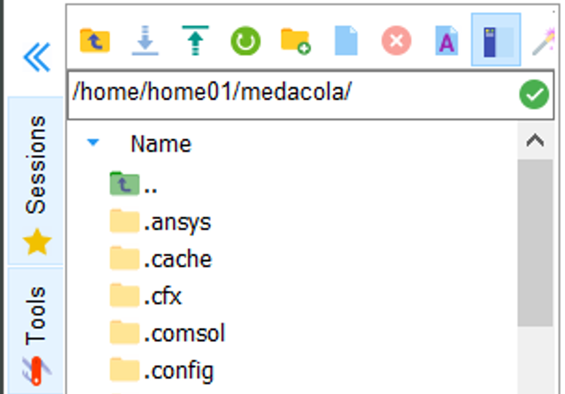

# File Transfer

Moving files onto and off the HPC systems is a crucial part of any researchers workflow and on this page we'll outline a number of approaches for performing file transfer.

## Using MobaXTerm

Windows users who make use of MobaXTerm can take advantage of some builtin tools for file management. By default when a user connects to ARC through MobaXTerm files are displayed in the left-hand file explorer window (highlighted in red).

 In this file explorer we can see all the folders and files within the directory path specified at the top (in this example `/home/home01/medacola/`), we can change this directory path if we wish to look in a different directory (that we have permission to view).

{ width=250px }

We can also download files from ARC onto our local computer by selecting them in the file explorer window and pressing the Download icon { width=50px }.

We can upload files and directories using this file explorer by dragging and dropping them into that window.

## Using a Terminal

### Using scp

### Using rsync

## Other file transfer options

### smbclient

### Using rclone

### sftp