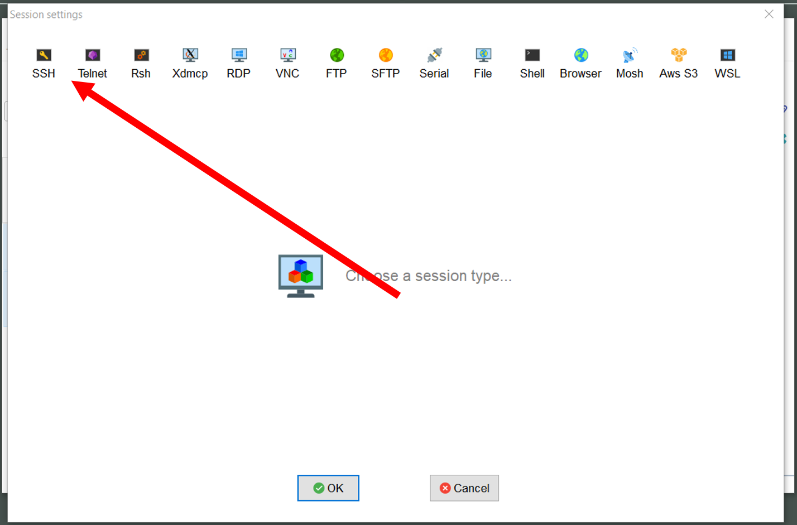
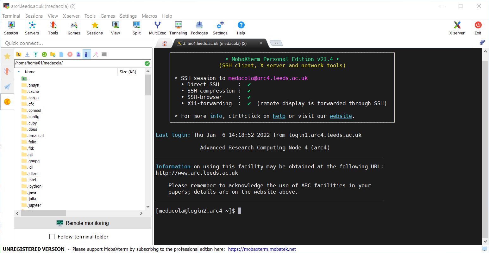
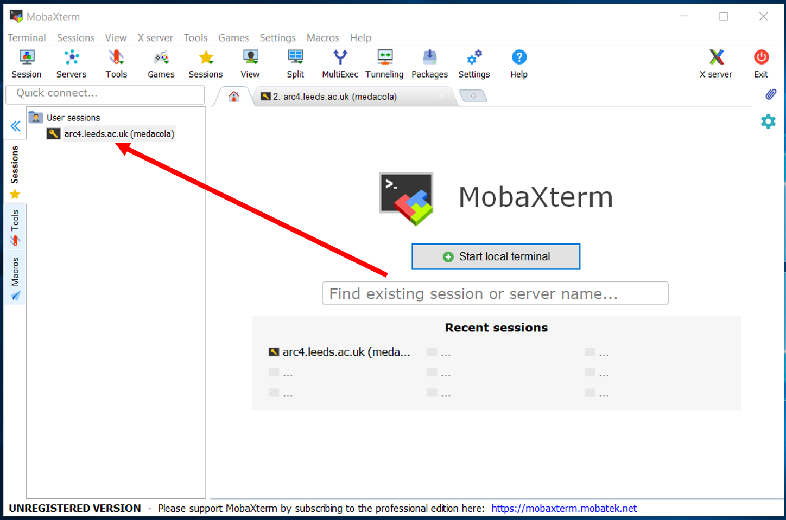
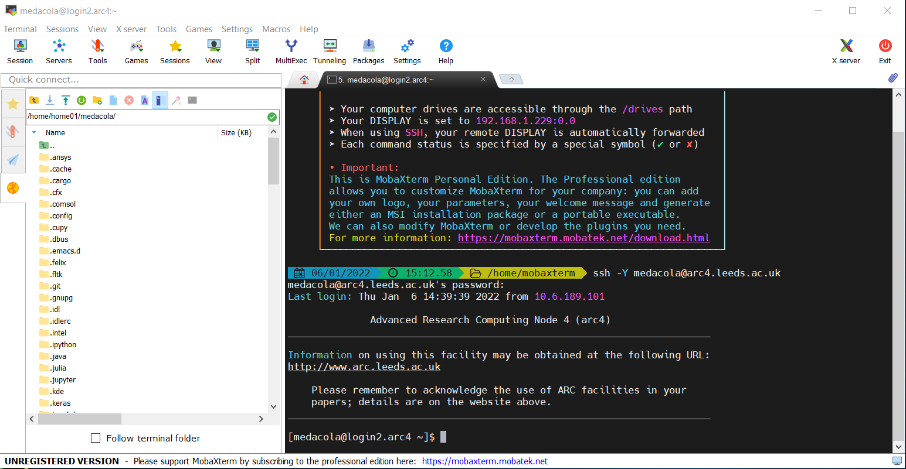

# Connecting from campus

## Connecting from Linux/MacOS systems

Linux and MacOS systems all come with a Terminal application that opens a command-line shell. In the following example code snippets we'll be connecting with the username `exuser`. When you come to log in to a system you'll need to use your own university username in place of `exuser`.

To log in from your Terminal use the following command:

```bash
# to log into ARC4
$ ssh exuser@arc4

# to log into ARC3
$ ssh exuser@arc3
```

The first time you SSH to either ARC4 or ARC3 you will be prompted to confirm the fingerprint of the host you're connecting to. You can check the unique fingerprints for ARC3 and ARC4 in the [fingerprint details](#fingerprint-details) below.

```
The authenticity of host 'arc4 (129.11.26.163)' can't be established.
ECDSA key fingerprint is SHA256:lPkw/7SrBqqQkS7lUm+tBN9JIGX9B8Gw7FdkK3MrpLM.
ECDSA key fingerprint is MD5:4f:d8:bc:ad:16:8b:ab:54:cf:29:04:c7:cc:20:5b:fc.
Are you sure you want to continue connecting (yes/no)?
```

ARC3:

```
The authenticity of host 'arc3 (129.11.26.153)' can't be established.
ECDSA key fingerprint is SHA256:cOA3zaJLawry0uVQ3VPveyxcrUJ+/8hRcr59xSbYRNI.
ECDSA key fingerprint is MD5:c2:b1:9a:c1:44:aa:ba:a1:db:c6:b7:d4:48:9d:74:89.
Are you sure you want to continue connecting (yes/no)?
```

You should confirm the key fingerprints match from fingerprints shown in the [fingerprint details](#fingerprint-details) section and type `yes` and press Enter to proceed.
If the keys do not match do **not** continue and contact Research Computing immediately via [https://bit.ly/arc-help](https://bit.ly/arc-help)

You will then be prompted for your password.

```bash
$ ssh exuser@arc4
exuser@arc4's password:
```

If you type your password incorrectly you will get a `Permission denied, please try again` message.
If this happens re-enter your password but be extra careful!

```{note} For security placeholder characters (like an asterisk)
will not appear as you type your password. Your keystrokes are recorded so please type carefully!
```

When you enter your correct password you'll see the ARC4 message of the day (shown below) and have successfully connected.

```bash

              Advanced Research Computing Node 4 (arc4)
________________________________________________________________________

Information on using this facility may be obtained at the following URL:
http://www.arc.leeds.ac.uk

    Please remember to acknowledge the use of ARC facilities in your
    papers; details are on the website above.
________________________________________________________________________

[exuser@login1.arc4 ~]$
```

## Connecting from Windows

Connecting from Windows requires the installation of an SSH client. We recommend and support users using MobaXTerm, please consult the [setup section](../logon.html#installing-mobaxterm) about installing this application.

### Connecting via MobaXTerm

```{warning}
**As of July 2021 the University is using 2-factor authentication for password-based access to remote-access.**
You will need to make sure you have [enrolled with Duo with your University account](https://it.leeds.ac.uk/it?id=kb_article&sysparm_article=KB0014659) and will be required to [use Duo to authenticate](https://it.leeds.ac.uk/it?id=kb_article&sysparm_article=KB0014641) after submitting your password to remote-access.
```

Once you have MobaXTerm downloaded you can connect to ARC via two mechanisms: using the [builtin local terminal to connect using SSH commands](#using-the-mobaxterm-terminal); or creating an [SSH session via the GUI](#creating-an-ssh-session).

#### Creating an SSH session

You can create an SSH session to connect to ARC using the following steps:

| 1. Open the initial MobaXTerm Menu and select Session                                                  |
| ------------------------------------------------------------------------------------------------------ |
|  |

| 2. In the Session Wizard Window select SSH                                                  |
| ------------------------------------------------------------------------------------------- |
|  |

| 3. Input the basic setting details for SSH session: the host (address of ARC), the username (your university username). Then click OK.                                  |
| ----------------------------------------------------------------------------------------------------------------------------------------------------------------------- |
|  |

| 4. You will immediately be prompted for your password to connect to ARC4 (use your standard university password)                       |
| -------------------------------------------------------------------------------------------------------------------------------------- |
|  |

```{note} For security placeholder characters
will not appear as you type your password. Your keystrokes are recorded so please type carefully!
```

| 5. If you submit the correct password you will receive a new prompt and will see the ARC4 message of the day                                                            |
| ----------------------------------------------------------------------------------------------------------------------------------------------------------------------- |
|  |

| 6. You can restart an existing session after it has closed by double-clicking the session under the User sessions folder on the left-hand panel of the main MobaXTerm menu |
| -------------------------------------------------------------------------------------------------------------------------------------------------------------------------- |
|          |

#### SSHing via the MobaXTerm Terminal

We can use the MobaXTerm Terminal like a standard unix shell to navigate around our local computer and also to SSH onto remote hosts including ARC.

| 1. Select the local terminal button on MobaXTerm to start the local terminal                                                |
| --------------------------------------------------------------------------------------------------------------------------- |
|  |

| 2. Within a local Terminal on MobaXTerm we use the `ssh` command to connect to ARC. We use `-Y` here to [enable graphical forwarding](./x11-graphics) |
| ----------------------------------------------------------------------------------------------------------------------------------------------------- |
|                  |

| 3. Next we are prompted to enter the account password (this will be your standard University password) to connect to `arc4.leeds.ac.uk` |
| --------------------------------------------------------------------------------------------------------------------------------------- |
|                |

| 4. Once we have entered the correct password your prompt will change and the message of the day for ARC4 will be displayed |
| -------------------------------------------------------------------------------------------------------------------------- |
|                                 |
