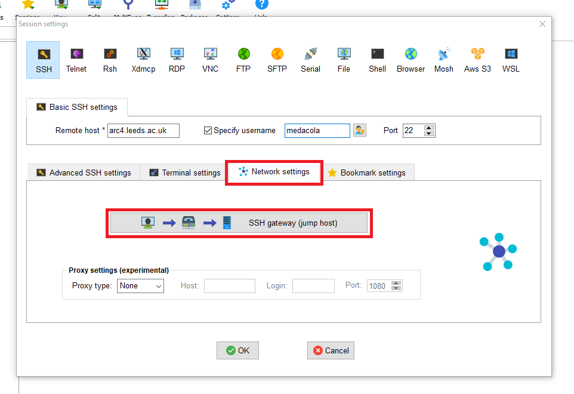
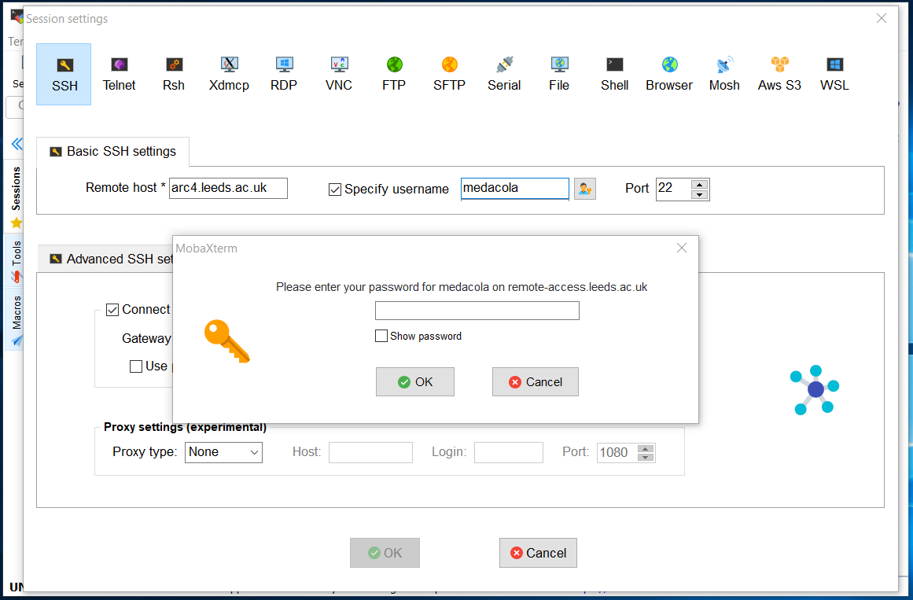
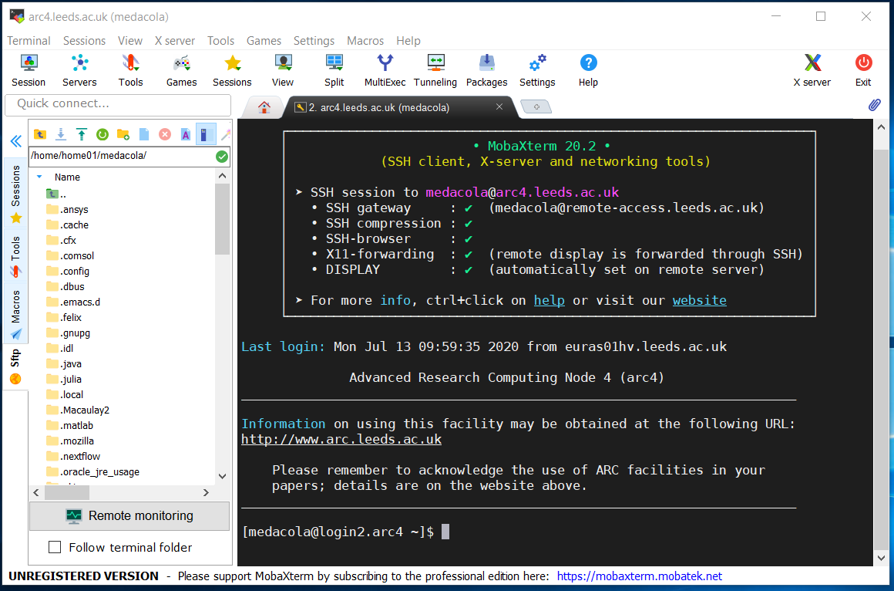
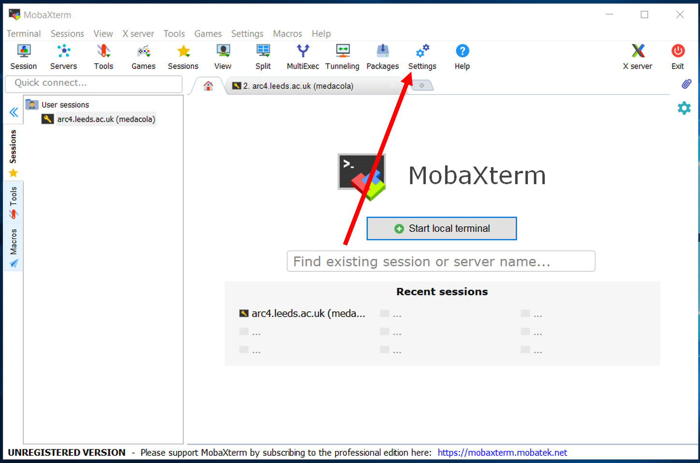
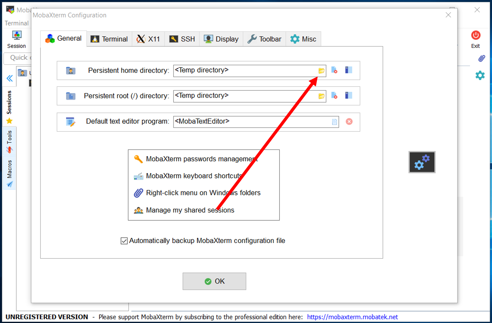
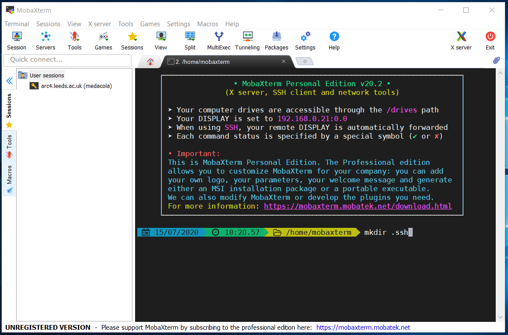
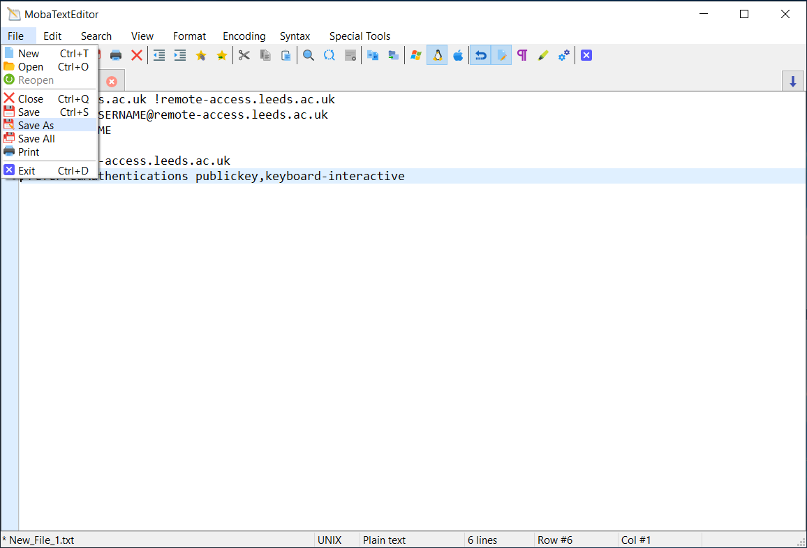
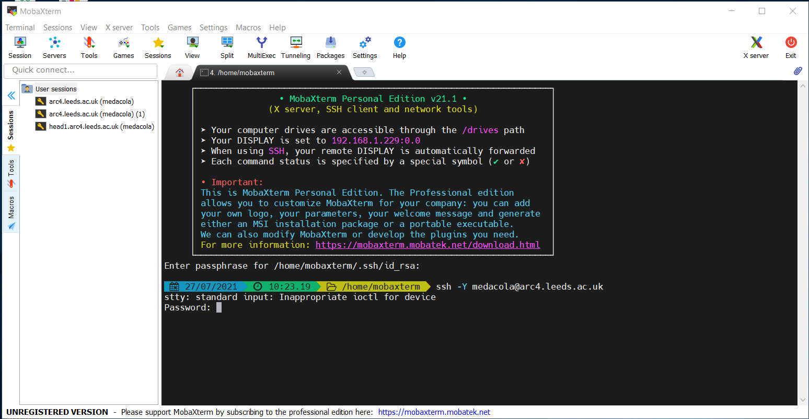
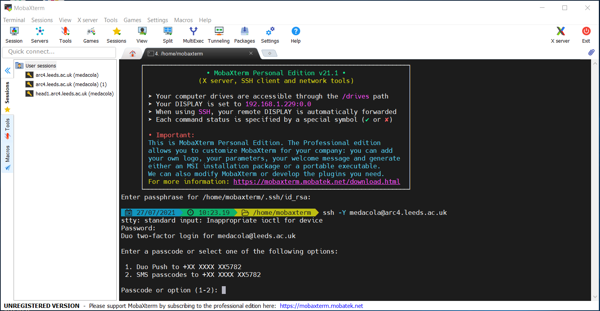
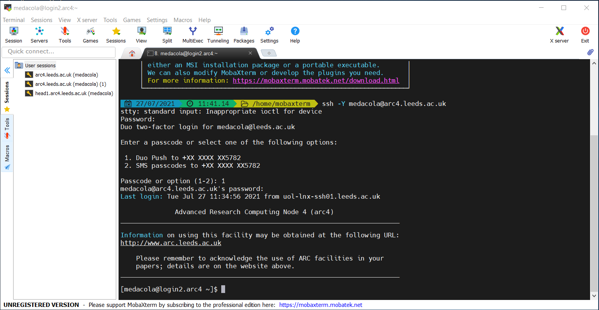

# Connecting from off campus

When connecting from off campus additional steps are required to enable you to connect as the University HPC systems are only reachable from within the University network.

## Connecting from Linux/MacOS systems

```{warning}
**As of July 2021 the University is using 2-factor authentication for password-based access to remote-access.**
You will need to make sure you have [enrolled with Duo with your University account](https://it.leeds.ac.uk/it?id=kb_article&sysparm_article=KB0014659) and will be required to [use Duo to authenticate](https://it.leeds.ac.uk/it?id=kb_article&sysparm_article=KB0014641) after submitting your password to remote-access.
```

In order to connect to ARC when you're off campus you'll need to do some extra configuration so that your SSH connection goes via our `remote-access` server. The following steps outline how to setup this configuration:

1. Open a Terminal on your Linux/macOS machine
2. Create a directory called `.ssh` in your home directory (if one doesn't already exist)

   ```bash
   $ mkdir ~/.ssh
   ```

3. Then open a text editor of your choice and create a file called `config` in your `.ssh` directory

   ```bash
   # for instance use the simple nano text editor
   $ nano ~/.ssh/config
   ```

4. Within this file include the following contents where `USERNAME` is replaced by your university username

   ```
   Host *.leeds.ac.uk !remote-access.leeds.ac.uk
   ProxyJump USERNAME@remote-access.leeds.ac.uk
   User USERNAME
   ```

   ````{admonition} Old version of SSH
   If you're using an old version of OpenSSH, you may get an error: `Bad configuration option: ProxyJump`.  In this case you'll want to use this instead:

   ```
   Host *.leeds.ac.uk !remote-access.leeds.ac.uk
   ProxyCommand ssh -o PreferredAuthentications=keyboard-interactive -W %h:%p USERNAME@remote-access.leeds.ac.uk
   User USERNAME
   ```
   ````

5. Save this file and your configuration is all set up!

You should now run the normal SSH commands in the terminal specifying the host you wish to connect to.

```bash
# to connect to ARC4
$ ssh exuser@arc4.leeds.ac.uk

# to connect to ARC3
$ ssh exuser@arc3.leeds.ac.uk
```

You'll be prompted to login to remote-access.leeds.ac.uk first and may be presented with an interactive login that looks like below:

```bash
$ ssh arc4.leeds.ac.uk
Password:
```

After entering your password carefully if it is correct you will receive the Duo 2 factor authentication prompt.

```bash
$ ssh arc4.leeds.ac.uk
Password:
Duo two-factor login for exuser@leeds.ac.uk

Enter a passcode or select one of the following options:

 1. Duo Push to +XX XXXX XXXXXXX
 2. SMS passcodes to +XX XXXX XXXXXX (next code starts with: 2)

Passcode or option (1-2):
```

Enter your prefered option and authenticate using Duo and you will be prompted to enter your password for ARC4.

```bash
$ ssh arc4.leeds.ac.uk
Password:
Duo two-factor login for exuser@leeds.ac.uk

Enter a passcode or select one of the following options:

 1. Duo Push to +XX XXXX XXXXXX
 2. SMS passcodes to +XX XXXX XXXXXX (next code starts with: 2)

Passcode or option (1-2): 1
exuser@arc4.leeds.ac.uk's password:
```

Again carefully enter your password and if you've entered it correctly you'll see the ARC4 message of the day (shown below) and have successfully connected.

```bash

              Advanced Research Computing Node 4 (arc4)
________________________________________________________________________

Information on using this facility may be obtained at the following URL:
http://www.arc.leeds.ac.uk

    Please remember to acknowledge the use of ARC facilities in your
    papers; details are on the website above.
________________________________________________________________________

[exuser@login1.arc4 ~]$
```

## Connecting from Windows

Connecting from Windows requires the installation of an SSH client. We recommend and support users using MobaXTerm, please consult the [setup section](../logon.html#installing-mobaxterm) about installing this application.

### Connecting via MobaXTerm

```{warning}
**As of July 2021 the University is using 2-factor authentication for password-based access to remote-access.**
You will need to make sure you have [enrolled with Duo with your University account](https://it.leeds.ac.uk/it?id=kb_article&sysparm_article=KB0014659) and will be required to [use Duo to authenticate](https://it.leeds.ac.uk/it?id=kb_article&sysparm_article=KB0014641) after submitting your password to remote-access.
```

Once you have MobaXTerm downloaded you can connect to ARC via two mechanisms: using the [builtin local terminal to connect using SSH commands](#using-the-mobaxterm-terminal); or creating an [SSH session via the GUI](#creating-an-ssh-session).

#### Creating an SSH session

You can create an SSH session to connect to ARC using the following steps:

| 1. Open the initial MobaXTerm Menu and select Session                                                  |
| ------------------------------------------------------------------------------------------------------ |
|  |

| 2. In the Session Wizard Window select SSH                                                  |
| ------------------------------------------------------------------------------------------- |
|  |

| 3. Input the basic setting details for SSH session: the host (address of ARC), the username (your university username)                                                  |
| ----------------------------------------------------------------------------------------------------------------------------------------------------------------------- |
|  |

| 4. Select the Network Settings tab within the Session Settings window                                                  |
| ---------------------------------------------------------------------------------------------------------------------- |
|  |

| 5. Click on the large button labelled "SSH gateway (jump host)" and input details for connecting to remote-access.leeds.ac.uk (Gateway SSH server) and specify your username |
| ---------------------------------------------------------------------------------------------------------------------------------------------------------------------------- |
|                                                                |

| 6. You will immediately be prompted for your password to connect to the remote-access server                                                  |
| --------------------------------------------------------------------------------------------------------------------------------------------- |
|  |

| 7. You will immediately be prompted for to enter your [Duo two-factor code](https://it.leeds.ac.uk/it?id=kb_article&sysparm_article=KB0014641) which can be found on your Duo App |
| --------------------------------------------------------------------------------------------------------------------------------------------------------------------------------- |
|              |

| 8. After it accepts your password it will request your password again, this time to log into ARC4 (This may not happen automatically and you may need to double click on session name that appears on the right hand User sessions section) |
| ------------------------------------------------------------------------------------------------------------------------------------------------------------------------------------------------------------------------------------------- |
|                                                                                           |

```{note} For security placeholder characters
will not appear as you type your password. Your keystrokes are recorded so please type carefully!
```

| 9. Once successful you will see the ARC4 message of the day and the ARC prompt                                                  |
| ------------------------------------------------------------------------------------------------------------------------------- |
|  |

| 10. You can restart an existing session after it has closed by double-clicking the session under the User sessions folder on the left-hand panel of the main MobaXTerm menu |
| --------------------------------------------------------------------------------------------------------------------------------------------------------------------------- |
|           |

#### Using the MobaXTerm Terminal

Alternatively, you can connect to ARC using the builtin Terminal within MobaXTerm and use the `ssh` command.

##### Configuring MobaXTerm Terminal

In order to successfully connect off-campus you are required to adjust some settings within MobaXTerm to create a persistent home directory and create a configuration file for SSH.

| 1. Open the initial MobaXTerm Menu and select Settings                                                |
| ----------------------------------------------------------------------------------------------------- |
|  |

| 2. Select the folder icon on the right-hand side of the Persistent home directory setting box                                                |
| -------------------------------------------------------------------------------------------------------------------------------------------- |
|  |

| 3. Select a folder location to use for your persistent home directory (this can be any writeable folder on your computer), here I am using my C:\User\university_username folder |
| -------------------------------------------------------------------------------------------------------------------------------------------------------------------------------- |
|                                                              |

| 4. This takes you back to the MobaXTerm Setting Menu, where you can now select OK                                                |
| -------------------------------------------------------------------------------------------------------------------------------- |
|  |

| 5. You will then be prompted to restart MobaXTerm so that the new settings are applied                                                |
| ------------------------------------------------------------------------------------------------------------------------------------- |
|  |

| 6. When MobaXTerm restarts, select the Start Local Terminal option                                                |
| ----------------------------------------------------------------------------------------------------------------- |
|  |

| 7. This takes you to the MobaXTerm terminal view                                                |
| ----------------------------------------------------------------------------------------------- |
|  |

| 8. Next create a folder called `.ssh` using the command `mkdir .ssh`                            |
| ----------------------------------------------------------------------------------------------- |
|  |

```{note} If this folder already exists you will get an error saying this file/folder already exists just skip to step 9

```

| 9. Then go to Tools > MobaTextEditor                                                            |
| ----------------------------------------------------------------------------------------------- |
|  |

| 10. Type the contents of the file as follows where `USERNAME` is your university username                                                                                                                                                             |
| ----------------------------------------------------------------------------------------------------------------------------------------------------------------------------------------------------------------------------------------------------- |
| <pre id="codecell0"> Host \*.leeds.ac.uk !remote-access.leeds.ac.uk <br> ProxyJump USERNAME@remote-access.leeds.ac.uk <br> User USERNAME <br> <br> Host remote-access.leeds.ac.uk <br> PreferredAuthentications publickey,keyboard-interactive </pre> |
|                                                                                                                                                       |

| 11. Once complete go to File > Save As                                                |
| ------------------------------------------------------------------------------------- |
|  |

| 12. Select the `.ssh` folder you created in the step 8.                                               |
| ----------------------------------------------------------------------------------------------------- |
|  |

| 13. Name the file as `config` and press Save and close MobaTextEditor                       |
| ------------------------------------------------------------------------------------------- |
|  |

And now MobaXTerm should be configured so we can SSH to ARC using the MobaXTerm Terminal.

##### SSHing via the MobaXTerm Terminal

We can use the MobaXTerm Terminal like a standard unix shell to navigate around our local computer and also to SSH onto remote hosts including ARC. In order to connect to ARC we need to make sure we have configured MobaXTerm as described in [the above section](#configuring-mobaxterm-terminal)

| 1. Within a local Terminal on MobaXTerm we use the `ssh` command to connect to ARC                                                 |
| ---------------------------------------------------------------------------------------------------------------------------------- |
|  |

| 2. We are then prompted to submit our password to connect to `remote-access.leeds.ac.uk`                                   |
| -------------------------------------------------------------------------------------------------------------------------- |
|  |

| 3. We are then prompted select how to receive a Duo 2 factor authentication prompt either via the app or as a text message. Select your preferred option and either approve the push or input a passcode that is sent to you via SMS |
| ------------------------------------------------------------------------------------------------------------------------------------------------------------------------------------------------------------------------------------ |
|                                                                                                                     |

| 3. We are then prompted to submit our password to connect to `arc4.leeds.ac.uk`                                   |
| ----------------------------------------------------------------------------------------------------------------- |
|  |

| 4. Once we have successfully submitted our passwords our prompt will change and the message of the day for ARC4 will be displayed |
| --------------------------------------------------------------------------------------------------------------------------------- |
|                                            |
