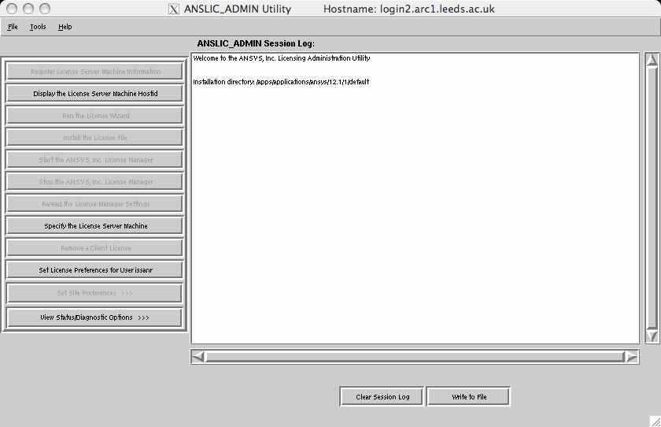
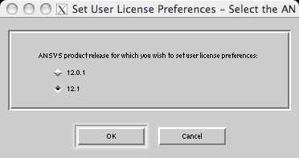
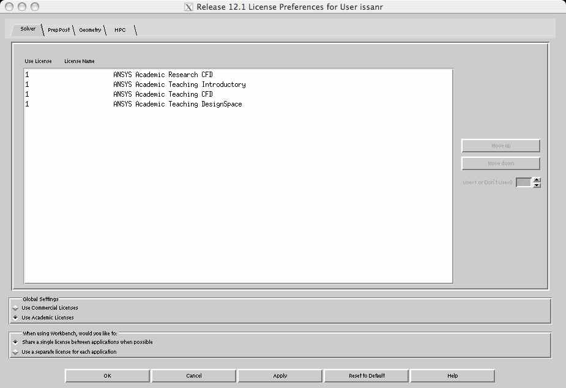

# Ansys

Versions of Ansys Fluent and CFX are installed for Leeds researchers who have access to either their own or a departmental license. This supports the Infiniband interconnect so can be used for jobs of \>24 (for ARC3) or \>40 (for ARC4) processors in size.

Information on Ansys can be found on the [Ansys web site](http://www.ansys.com/en-GB).

## Setting up the license

The license is obtained by setting the `ANSYSLMD_LICENSE_FILE` variable. To set it in bash do:

```bash
$ export ANSYSLMD_LICENSE_FILE=<port>@<host>
```

If accessing for the first time, there is an additional step (see the next section on this page) required to choose whether you are using commercial or academic licenses. To get the values of `<port>@<host>` specific to your group/department please contact the Client IT Team via [Service Now](https://leeds.service-now.com/it).

To make Ansys Fluent and CFX available for use:

```bash
$ module add ansys
```

To load a specific version of Ansys, specify this on the module command

```bash
$ module add ansys/17.1
```

### [Running Fluent](./ansys/fluent)

Fluent specific information can be found by clicking the link above.

### [Running CFX](./ansys/cfx)

CFX specific information can be found by clicking the link above.

### [Running Chemkin](./ansys/chemkin)

Chemkin specific information can be found by clicking the link above.

## Additional Step for Using Ansys the First Time

Before running the Ansys module for the first time, there is a per-user setting that chooses whether commercial (default) or academic licenses should be used.

**For research purposes you should normally be using the academic licenses, unless you are untertaking commercially funded research.**

**Check with your supervisor if you need clarification on this.**

You will need a SSH connection with X-forwarding enabled to configure this setting. For more information on how to connect to the ARC systems and to enable X-forwarding visit the [Logging on page](../../getting_started/logon.html#graphics-forwarding-x11).

If you have not already done so, set the license server and port using the details provided by your supervisor:

```bash
$ export ANSYSLMD_LICENSE_FILE=<port>@<host>
```

Next, ensure that you have the Ansys module loaded for the particular version you wish to configure its licenses, e.g.:

```bash
$ module load ansys/17.1
```

For ansys version 17.1 (the latest version on the ARC clusters)

You now need to launch the license administration interface. The simplest way to do this is to start cfx:

```bash
$ cfx5
```

and select Tools/Ansys client Licensing Utility from the menu.

This will present you with the following window:



Select "set license preferences for user abcxyz"

In the next window, select the product you wish to configure (e.g. 12.1)



In the next window that appears, select the radio button that says Use academic licenses:



Select **OK**, then exit the license manager.

This will configure Ansys (both Fluent and CFX) to use Academic licenses for all future use.
