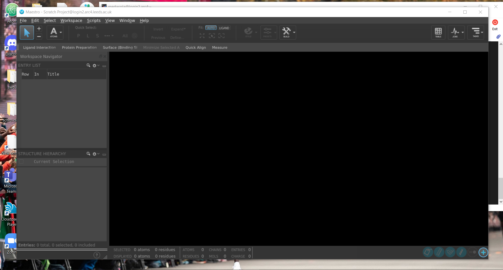

# Schrodinger

Both ARC3 and ARC4 have Schrodinger Suite 2020-1, Build 12 installed.

## Description

The [Schrodinger suite](https://www.schrodinger.com/platform), developed by [Schrodinger Inc](https://www.schrodinger.com/), is a computational chemistry program with a number of different tools for evaluating compounds in silico, with experimental accuracy on properties such as binding affinity and solubility.

## Licensing

To run Schrodinger suite programs a license is required and limits the number of cores available. You will be unable to load any schrodinger suite tools until you have specified the relevant license server information which you should request from your supervisor or department.

You will then need to set an environment variable when logged into ARC3/ARC4 that specifies the license host address and port number as follows:

```bash
# this is an example
$ export SCHROD_LICENSE_FILE=<port>@<host>
```

You will also need to include this within any job submission scripts to ensure your jobs don't terminate early because they haven't got the license server configured.

## Documentation

Documentation is available for Schrodinger on ARC3/ARC4. It is possible to load this directly on ARC3/ARC4 when connecting with [X11 graphical forwarding](../../getting_started/logon#graphics-forwarding-x11), using FireFox to open the HTML documentation pages with the following command:

```bash
$ module add schrodinger/2020-1

$ firefox $SCHRODINGER_HOME/docs/Documentation.htm
```

## Basic Usage

To access some of the Schrodinger suite of tools you can load the module with the command:

```bash
$ module add schrodinger/2020-1
```

This allows you to access a number of executables from the command line and adds a new environment variable `$SCHRODINGER_HOME` from which it is possible to access more executables via the `$SCHRODINGER_HOME/utilities` directory.
## Maestro

```{warning}
To use maestro from ARC3/ARC4 you will need to connect with [X11 graphical forwarding](../../getting_started/logon#graphics-forwarding-x11) enabled
```

Maestro is the primary graphic user interface to the Schrodinger suite of tools and can be used to submit jobs directly to the scheduling system.

To start maestro you will need to have added the schrodinger module and set the license server environment variable, after which you can run:

```bash
$ maestro 
```

This will load up a separate window containing the maestro GUI.



```{note}
It is not recommended to use maestro for developing your workflows via this method as the user experience can be quite laggy. It is **recommended** workflow files are produced on your local machine using Schrodinger 2020-1 and uploaded to ARC4 for use on the batch queuing system.
```

## Glide

```{warning}
Current licensing restrictions mean glide is only able to run on one core at any one time.
```

Glide is a tool that allows for high speed computation docking for screening large numbers of compounds. It is available from the command line or can be specified from within the Maestro GUI.

### Usage through command line

#### Preparing files

You should prepare your files on maestro in advance of running glide on the command line to perform computational docking. This will produce a number of files that you should transfer to the HPC system and will serve as the template for your job submission file, this includes:

- A .sh file, this shell file contains a generic glide command to use to run this workflow
- A .zip file containing receptor grid data
- An .sdf file (structure data file) containing data about input chemical structures
- A .in file, the input file for glide containing configuration settings

These files should be [transferred to the HPC](../../getting_started/file_transfer) where we'll write an additional file to submit them as a [batch job](../../usage/batchjob).

#### Creating a job submission file

Now that we've transferred our files onto the HPC we're ready to start creating a job submission file to submit our glide job to the scheduler. Maestro helps make this relatively easy by creating the `.sh` file we encountered earlier that contains most of the command we need to include in our job submission file.

Take this example `maestro.sh` for the input file `glide-dock_SP_1.in`:

```bash
"${SCHRODINGER}/glide" glide-dock_SP_1.in -OVERWRITE -adjust -HOST localhost:2 -TMPLAUNCHDIR
```

This gives us the barebones of what we need to include in our job submission file with some slight changes outlined below:

```bash
#$ -cwd
#$ -l h_rt=00:15:00
#$ -l h_vmem=1G

module add schrodinger/2020-1
export SCHROD_LICENSE_FILE=<port>@<host>

"${SCHRODINGER_HOME}/glide" -OVERWRITE -adjust -LOCAL -WAIT -DEBUG glide-dock_SP_1.in
```

Here we've specified to use the glide executable that exists within the `$SCHRODINGER_HOME` directory, we set the job to overwrite (`-OVERWRITE`) any previous job files, we set `-adjust` to allow the job to determine the size of subjobs automatically, `-LOCAL` means the job writes any output files to the current directory rather than a temporary directory, `-WAIT` means the job does not return the prompt until the job completes (this **must** be set when submitting a job to the scheduler), `-DEBUG` includes details of the job control operation in the log file that is produced during the run.

##### Retrieving tabular scoring data (optional)

By default `glide` outputs data in the poseviewer format (_pv.maegz) which can be opened by Maestro. You can also output a .csv file containing a selection of properties of all ligands by adding the following line to your `.in` file.

```
WRITE_CSV   1
```

### Usage through Maestro

```{note} **Help wanted!** <br>
This is something we aren't familiar with, maybe you are and can contribute to this help page! [Open an issue via GitHub](https://github.com/arcdocs/arcdocs.github.io/issues/new?title=Issue%20on%20page%20%2Fsoftware/applications/schrodinger.html&body=Your%20issue%20content%20here.) or contact us via https://bit.ly/arc-help 
```
